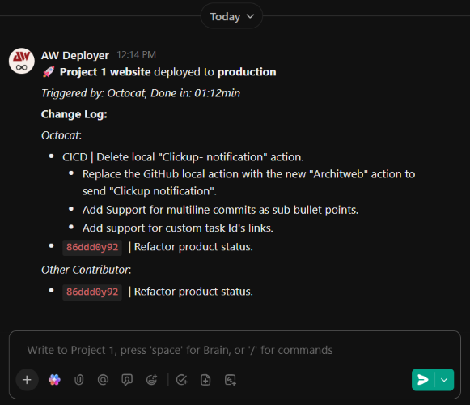

# ClickUpNotification

**ClickUpNotification** is a GitHub Action that notifies your team via a ClickUp chat channel, keeping them informed about the progress of the CI/CD pipeline up to the point where this action is triggered.
It summarizes the latest code changes, grouped by author and formatted as an organized changelog, along with the duration.

## Features

It'll Send message to ClickUp chat, including:

- Custom title for notifications
- Custom description
- Project name
- Triggered by
- Duration (configurable)
- Changelog since last run, grouped by author (configurable)
- Automatic ClickUp task links from (custom) task IDs in commit messages
- Single line or full commit message mode
- Emphasizes Conventional Commit types

## Screenshots




## Setup on ClickUp

In order to send messages, you need to create a token from a user. However, the message will appear as if sent by that user.
So, it is recommended to create a guest user in your team with a name like "GitHub Actions" or "CI/CD Messenger", then create a token from that account.

To create an **API token** within a guest user account:

- Log in to the desired account at [ClickUp](https://app.clickup.com).
- Click on **Settings** from the top-right menu.
- Click on **Apps** from the side menu.
- Click **Generate** under **API Token**.

You can copy `clickup_workspace_id` and `clickup_channel_id` by going to the desired chat channel and checking the URL of that page.
It should contain two numbers in a format like this:
`https://app.clickup.com/<WORKSPACE_ID>/chat/r/<CHANNEL_ID>`
Simply copy them from the link.

## Inputs

The action requires the following inputs to connect to ClickUp and identify your project, make sure to add them as secrets to your GitHub repository:

| Input                    | Description                                               | Type              | Required | Default |
| ------------------------ | --------------------------------------------------------- | ----------------- | -------- | ------- |
| `clickup_api_token`      | Your ClickUp API token (Personal or Bot)                  | string            | Yes      | `none`  |
| `clickup_workspace_id`   | The numerical ID of the ClickUp Workspace (Team)          | string            | Yes      | `none`  |
| `clickup_channel_id`     | The ID of the ClickUp List or Chat View for notifications | string            | Yes      | `none`  |
| `clickup_project_name`   | A descriptive name for your project (used in the message) | string            | Yes      | `none`  |
| `title`                  | Custom title for the notification message                 | string            | No       | `""`    |
| `description`            | Custom description for the notification message           | string            | No       | `""`    |
| `show_fetch_duration`    | Show duration information in the notification             | "true" \| "false" | No       | `true`  |
| `show_changelog_commits` | Show changelog commits in the notification                | "true" \| "false" | No       | `true`  |
| `full_commit_message`    | A flag to indicate whether to use full commit messages    | "true" \| "false" | No       | `true`  |

## Task ID Integration

You can link commit messages directly to ClickUp tasks by including a task ID reference in your commit message using the following format:

```md
task `TASK_ID` Your commit message here
ctask `CUSTOM_TASK_ID` Your commit message here
```

For example:

```md
task `86ddd0y92` Add new login functionality
ctask `TST-747` Add global log out functionality
```

The action will automatically convert this into a clickable link in the ClickUp notification:

[\`86ddd0y92\`](https://github.com/architweb/ClickUpNotification) | Add new login functionality

[\`TST-747\`](https://github.com/architweb/ClickUpNotification) | Add global log out functionality

Where the task ID becomes a clickable link to the task in ClickUp. This makes it easy for your team to navigate directly to the relevant tasks from deployment notifications.

## Architecture

**v2.0.0** introduces a modular architecture for better maintainability and flexibility:

### Modular Steps

The action is now split into three independent steps:

- **⏱️ Fetch Duration** (`./steps/fetch-duration`) - Calculates workflow execution time
- **📝 Fetch Commits** (`./steps/fetch-commits`) - Generates changelog from commit history
- **📢 Send ClickUp Notification** (`./steps/send-notification`) - Sends the formatted message to ClickUp

### Benefits

- **Configurable Components**: Enable/disable duration tracking or changelog independently
- **Better Testing**: Each step can be tested in isolation
- **Reusability**: Individual steps can be used in other workflows
- **Maintainability**: Cleaner code organization and easier debugging

### Message Format

The notification message structure adapts based on your configuration:

**With Custom Title:**

```
🚀 **branch-name** | **Project Name** | Custom Title

_Triggered by: Username, Done in: 02:15min_

_Custom description text_

**Change Log:**
[commit details if enabled]
```

**Default Format:**

```md
🚀 **Project Name** deployed to **branch-name**

_Triggered by: Username, Done in: 02:15min_

**Change Log:**
[commit details if enabled]
```

## Example Usage

Here's how you can integrate `ClickUpNotification` into your deployment workflow. This example triggers on pushes to `release/staging` or manual dispatch with full commit message mode enabled.

```yaml
name: Staging Deployment Notification

on:
  push:
    branches:
      - "release/staging"
  workflow_dispatch: # Allows manual triggering

jobs:
  build-and-deploy:
    runs-on: ubuntu-latest
    # Grant permissions needed for checkout and fetching commit history
    permissions:
      contents: read # To checkout the code and read commit history
      actions: read # To find the last successful workflow run for changelog generation

    steps:
      # Step 1: Check out the repository code
      - name: Checkout Code
        uses: actions/checkout@v4
        with:
          ref: "release/staging" # Ensure we are on the correct branch
          fetch-depth: 0 # Fetch all history to enable accurate changelog comparison

      # Step 2: Add your build, test, and deployment steps here...
      # Example:
      # - name: Build Project
      #   run: npm run build
      # - name: Deploy to Staging
      #   run: ./deploy_staging.sh      # Last step: Send ClickUp notification upon successful deployment
      - name: Send ClickUp Notification
        uses: architweb/ClickUpNotification@v2.0.0 # Use the latest version of the action
        with:
          # Pass the required secrets to the action
          clickup_api_token: ${{ secrets.CLICKUP_API_TOKEN }}
          clickup_workspace_id: ${{ secrets.CLICKUP_WORKSPACE_ID }}
          clickup_channel_id: ${{ secrets.CLICKUP_CHANNEL_ID }}
          clickup_project_name: ${{ secrets.CLICKUP_PROJECT_NAME }}
          # Optional parameters
          full_commit_message: "true" # Set to 'false' to use only first line of commit messages
          show_fetch_duration: "true" # Set to 'false' to hide duration information
          show_changelog_commits: "true" # Set to 'false' to hide changelog
          title: "🎉 Staging Deployment Complete" # Custom title (optional)
          description: "New features deployed to staging environment" # Custom description (optional)
```

## Advanced Usage Examples

### Minimal Notification (No Duration/Changelog)

Perfect for quick status updates:

```yaml
- name: Quick Status Update
  uses: architweb/ClickUpNotification@v2.0.0
  with:
    clickup_api_token: ${{ secrets.CLICKUP_API_TOKEN }}
    clickup_workspace_id: ${{ secrets.CLICKUP_WORKSPACE_ID }}
    clickup_channel_id: ${{ secrets.CLICKUP_CHANNEL_ID }}
    clickup_project_name: ${{ secrets.CLICKUP_PROJECT_NAME }}
    title: "⚡ Hotfix Applied"
    description: "Critical security patch deployed"
    show_fetch_duration: "false"
    show_changelog_commits: "false"
```

### Production Release with Full Details

Comprehensive notification for important deployments:

```yaml
- name: Production Release Notification
  uses: architweb/ClickUpNotification@v2.0.0
  with:
    clickup_api_token: ${{ secrets.CLICKUP_API_TOKEN }}
    clickup_workspace_id: ${{ secrets.CLICKUP_WORKSPACE_ID }}
    clickup_channel_id: ${{ secrets.CLICKUP_CHANNEL_ID }}
    clickup_project_name: ${{ secrets.CLICKUP_PROJECT_NAME }}
```
