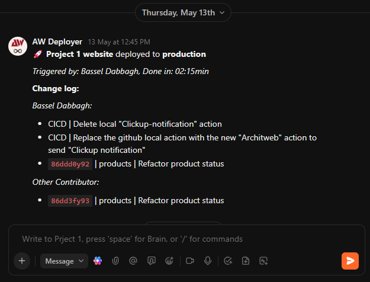

# ClickUpNotification

**ClickUpNotification** is a GitHub Action that notifies your team via a ClickUp chat channel, keeping them informed about the progress of the CI/CD pipeline up to the point where this action is triggered.
It summarizes the latest code changes, grouped by author and formatted as an organized changelog, along with the duration.

## Features

It'll Send message to ClickUp chat, including:

- Project name
- Triggered by
- Duration
- Changelog since last run, grouped by author
- Automatic ClickUp task links from commit messages

## Screenshot



## Setup on ClickUp

In order to send messages, you need to create a token from a user. However, the message will appear as if sent by that user.
So, it is recommended to create a guest user in your team with a name like "GitHub Actions" or "CI/CD Messenger", then create a token from that account.

To create an **API token** within a guest user account:

- Log in to the desired account at [ClickUp](https://app.clickup.com).
- Click on **Settings** from the top-right menu.
- Click on **Apps** from the side menu.
- Click **Generate** under **API Token**.

You can copy `clickup_workspace_id` and `clickup_channel_id` by going to the desired chat channel and checking the URL of that page.
It should contain two numbers in a format like this:
`https://app.clickup.com/<WORKSPACE_ID>/chat/r/<CHANNEL_ID>`
Simply copy them from the link.

## Inputs

The action requires the following inputs to connect to ClickUp and identify your project, make sure to add them as secrets to your GitHub repository:

| Input                  | Description                                               | Required | Default |
| ---------------------- | --------------------------------------------------------- | -------- | ------- |
| `clickup_api_token`    | Your ClickUp API token (Personal or Bot)                  | Yes      | `none`  |
| `clickup_workspace_id` | The numerical ID of the ClickUp Workspace (Team)          | Yes      | `none`  |
| `clickup_channel_id`   | The ID of the ClickUp List or Chat View for notifications | Yes      | `none`  |
| `clickup_project_name` | A descriptive name for your project (used in the message) | Yes      | `none`  |

## Task ID Integration

You can link commit messages directly to ClickUp tasks by including a task ID reference in your commit message using the following format:

```
task `TASK_ID` Your commit message here
```

For example:
```
task `86ddd0y92` Add new login functionality
```

The action will automatically convert this into a clickable link in the ClickUp notification:

[\`86ddd0y92\`](https://github.com/architweb/ClickUpNotification) | Add new login functionality

Where the task ID becomes a clickable link to the task in ClickUp. This makes it easy for your team to navigate directly to the relevant tasks from deployment notifications.

## Example Usage

Here's how you can integrate `ClickUpNotification` into your deployment workflow. This example triggers on pushes to `release/staging` or manual dispatch.

```yaml
name: Staging Deployment Notification

on:
  push:
    branches:
      - "release/staging"
  workflow_dispatch: # Allows manual triggering

jobs:
  build-and-deploy:
    runs-on: ubuntu-latest
    # Grant permissions needed for checkout and fetching commit history
    permissions:
      contents: read # To checkout the code and read commit history
      actions: read # To find the last successful workflow run for changelog generation

    steps:
      # Step 1: Check out the repository code
      - name: Checkout Code
        uses: actions/checkout@v4
        with:
          ref: "release/staging" # Ensure we are on the correct branch
          fetch-depth: 0 # Fetch all history to enable accurate changelog comparison

      # Step 2: Add your build, test, and deployment steps here...
      # Example:
      # - name: Build Project
      #   run: npm run build
      # - name: Deploy to Staging
      #   run: ./deploy_staging.sh

      # Last step: Send ClickUp notification upon successful deployment
      - name: Send ClickUp Notification
        # Use a specific version tag (like @v1.4.2) for stability
        uses: architweb/ClickUpNotification@v1
        with:
          # Pass the required secrets to the action
          clickup_api_token: ${{ secrets.CLICKUP_API_TOKEN }}
          clickup_workspace_id: ${{ secrets.CLICKUP_WORKSPACE_ID }}
          clickup_channel_id: ${{ secrets.CLICKUP_CHANNEL_ID }}
          clickup_project_name: ${{ secrets.CLICKUP_PROJECT_NAME }}
```
